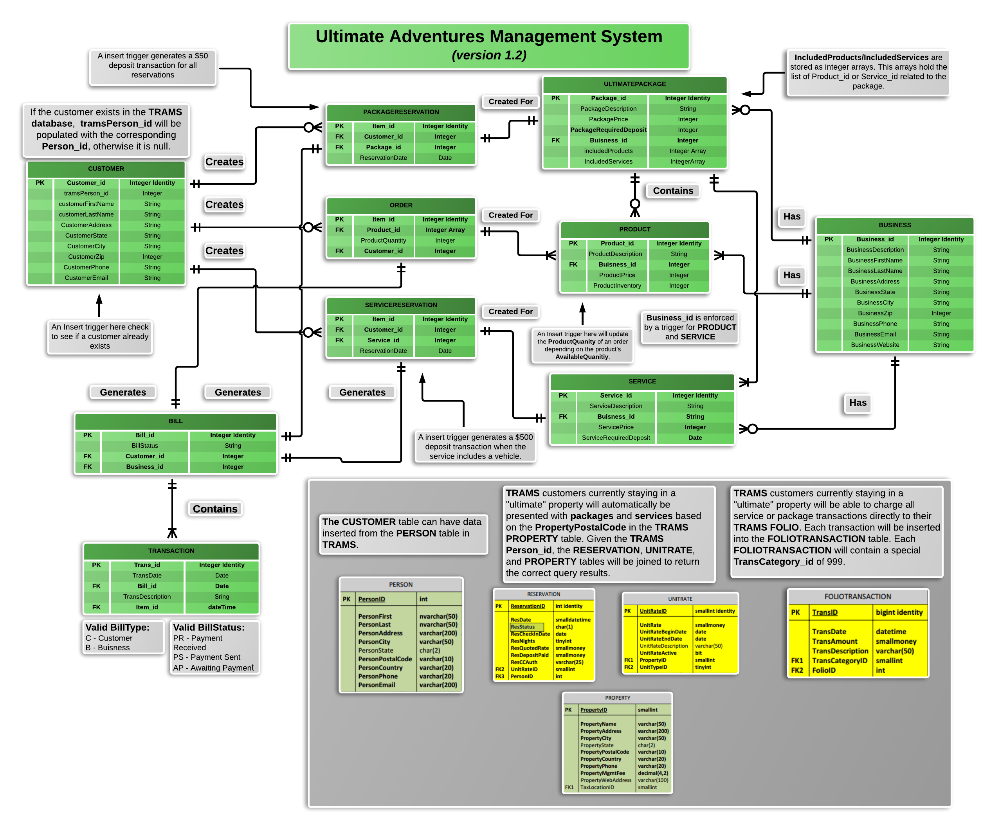

## Ultimate Adventures Management System

<hr>

### Running The DB creation script

1. Install MongoDB and NodeJS (includes NPM)
2. Start MongoDB service:
    ```
    $ mongod
    ```
3. Install other NodeJs dependencies:
    ```
    npm install
    ```
4. Build the database :
    ```
    node create-db.js
    ```

### Using My MongoDB NodeJS Functions

1. Open the NodeJS Terminal
2. Import (require)the ```create-db.js``` function.
3. You can now initialize the DB connection and execute functions.

### Database ERD
##### Direct [Link](https://www.lucidchart.com/invitations/accept/c1603f37-2065-44e4-8d12-055bbb6cebf0) To LucidChart ERD
<hr>



##### Contributors: Andrew Lane